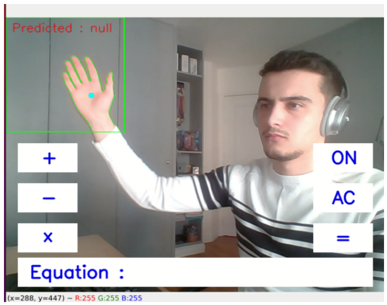
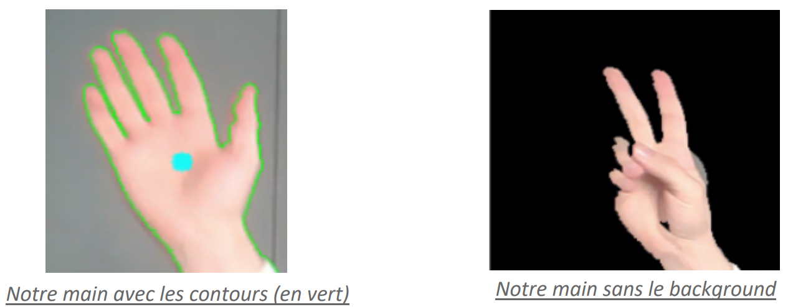
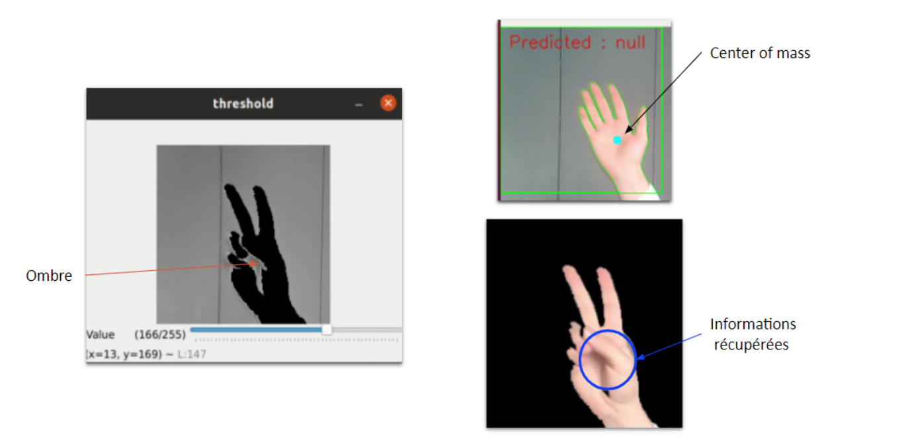
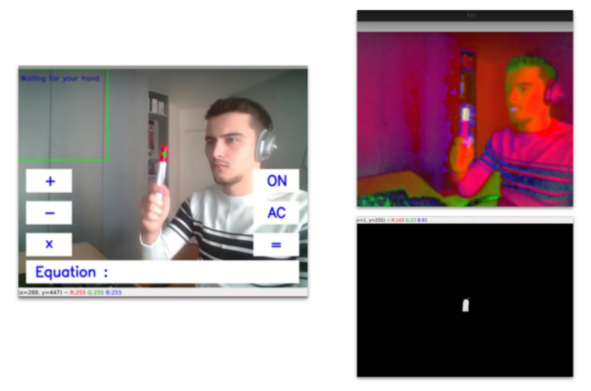

# AI HAND

##### 🚧   In progress    🚧 

## _Apprendre la langue des signes avec une IA_

AI HAND est un projet visant à l'apprentissage de la langue des signes de façon ludique et interactive. Cette première version du projet s'illustre par une calculatrice visuelle, on réalise des opérations mathématiques avec les chiffres (0-9) en langage des signes. Les prochaines grandes étapes :
- Apprentissage des lettres, des mots, et phrases
- Utilisation ludique => style calculatrice
- ✨Interface graphique ✨
- Segmentation 

## Demo

### Vidéo complète 📹 : ➡️ [AI HAND DEMO](https://www.youtube.com/watch?v=Eor8sb6j2mY)

## Tech

Pour ce projet voici la stack utilisé:

- Python 🐍
- OpenCV 
- Keras 

et Kaggle pour le dataset ([Sign Language Digits Dataset](https://www.kaggle.com/ardamavi/sign-language-digits-dataset)).😀 

## Conception

- Un script de traitement d'images
- Un modèle de Deep Learning entrainé sur le dataset

### Traitement d'image

Quelques étapes importantes dans la partie traitement d'image du projet :
-   On capture la ROI "Region Of Interest"
   

-   Après le seuillage, on détermine les contours de notre main

-   Cependant, sur certains signes nous produisons une ombre sur nous-même, et de ce fait nous perdons certaines informations. Pour y remédier on capte le center of mass de l’image qui sera donc le centre de notre main, l’endroit où il y aura le plus souvent de l’ombre. En captant ce center of mass on récupère alors les informations perdues.

-   Captation du stylo rouge nous permettant de sélectionner les opérations

### Le modèle de Deep Learning

## Installation

## License

MIT

