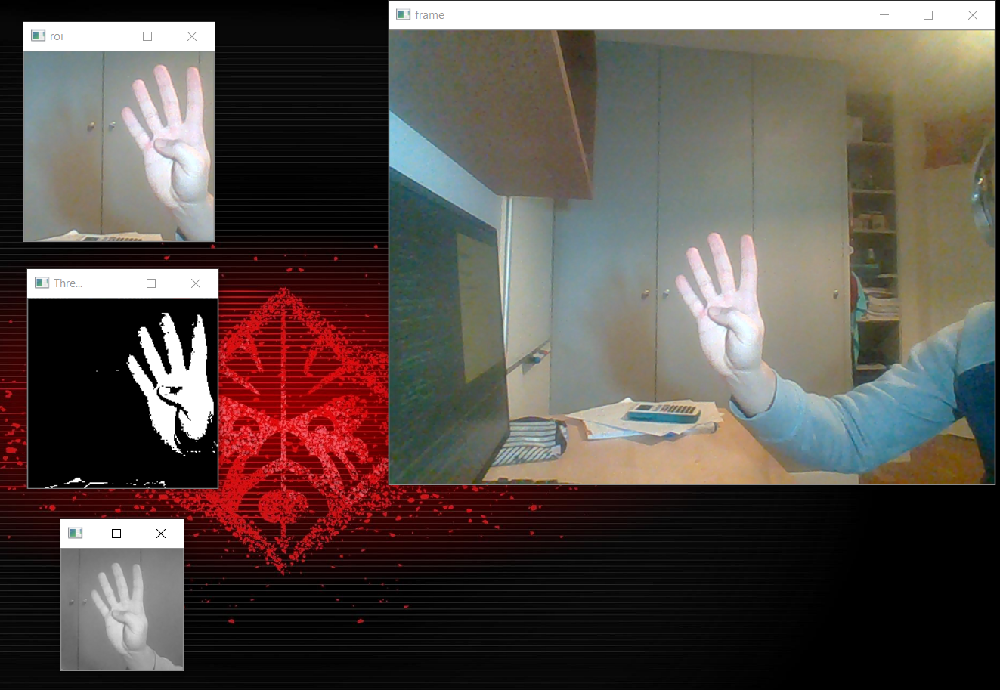

# AIHand

## <-- Still in work -->

<em> A complete README will be done soon </em>

## Demo

### First part detect Hand:

-   Capture 200x200 ROI from the frame
-   Capture the hand with center mass roi
-   Then center it in 128x128 px image

### Rework hand detection & digit prediction :

Detecting the hand on a part of the image.
Finding countour & center of mass with thresholding.
Remove the background.
Make prediction with loaded model. 

### Maths operations :

Detecting red pen to choose the wanted operation

